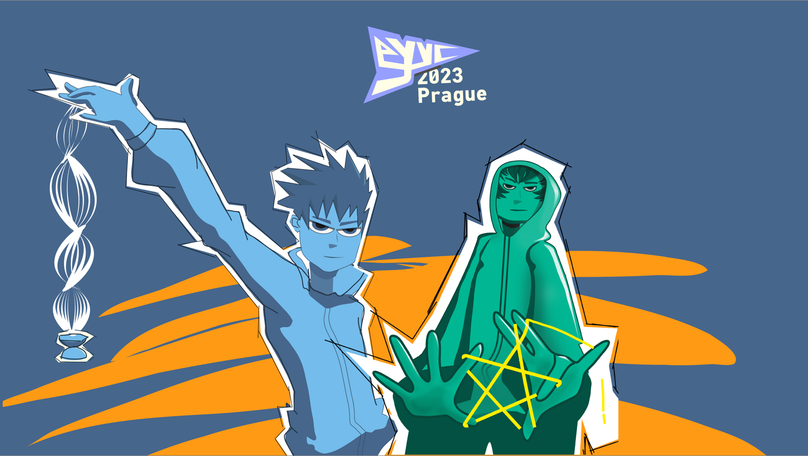

Hi i'm Jindra and this is my thesis presentation.

When it came to choosing a thesis topic I took the opprotunity to work on something that is personally close to me and chose to create a visual style for a yoyo competition. Specifically the european championship taking place annually and hosting players and spectators from all over the continent and beyond. I have been playing yoyo and competing for over a decade now spectating and participating in many contests over the years which  gives me some insight in how such event operates and what the community and wider public responds to relating to this activity. The purpose of holding these competitions is not only to find the best player and satisfy audiences hunger for new exciting performances, but also to present this activity to the wider public. And to it the look into this community should represent what it is like in general not only in this once in a year moment of serious competition.

 

Presentation of past years have often had a serious look, evoking authority. But also looked somewhat dry coming short of representing the fun, loose nature of the sport.
  
   
  
 Other place for exposute for yoyo is from the ads, products and campaings of yoyo manufacturers. Where we can see the more fun, casual approach, that more accurately represents the nature of yoyo and even the mood of competitions, which might have serious stakes, but are carried out in a loose fun atmosphere.
 
 Startin off with the logo, the aim was to create something subdued but with a distinct personality. by the nature of how yoyoing works there are some formations and elements you find yorself in most often, they are usually a downwards pointing triangle with it's two top vertices being the hands and the bottom one the yoyo. 

     
  I used the shape to create this logotype
  
  
  
  The other key element of the communication would be character drawings ceplementing messages, communication and visuals of the competition. They are supposed to add to the attractiveness, point to some of the fun older ways of presenting yoyo. And also reminisc to the somewhat counter-culture roots of yoyoing, as it i would maybe suprisingly often find itself slotted into the same category with skateboarding, graffiti or street dance.
  
  
 
social media communication with added motion and an exaple of how photos are composited into the cartoon like world of this visual style
 
  
       

An intro for post competition released videos of all performances

 

Finally a look at the merchandising in the form of a yoyo nad  a yoyo holder
  
   
     
       
     
         

 
 ...
 

